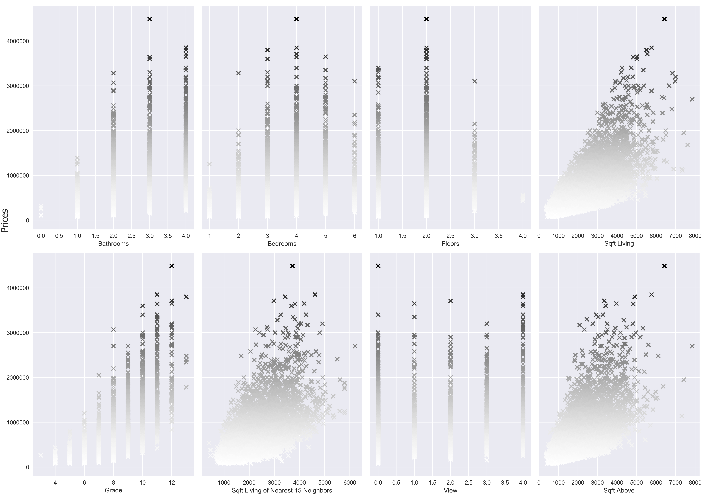
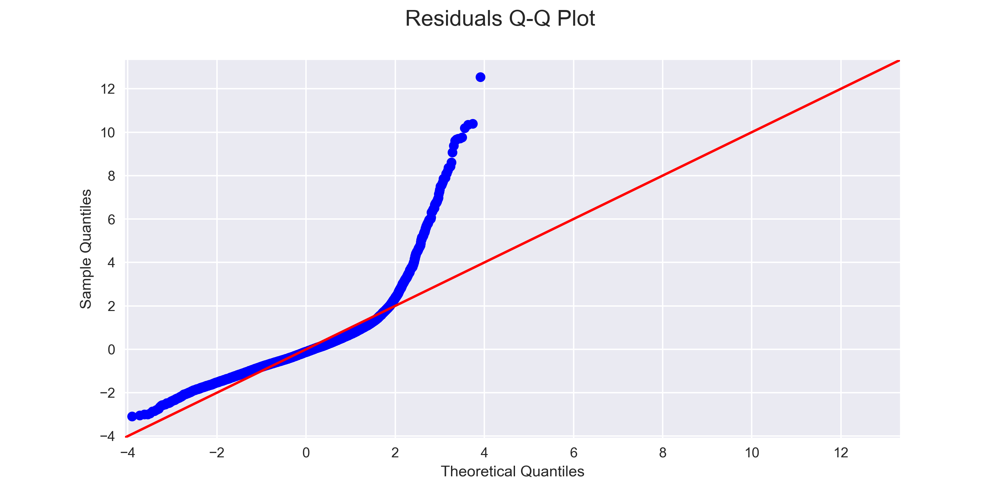
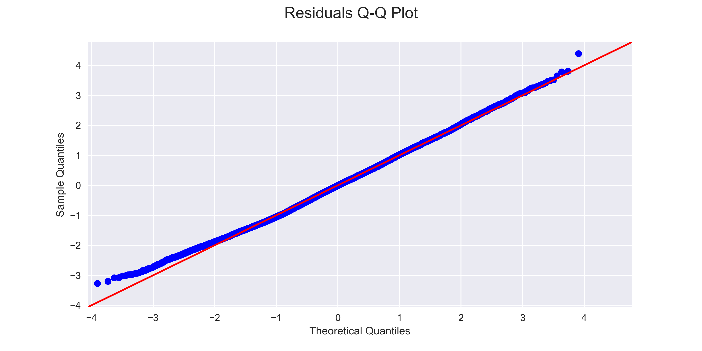

# King County Regression

**Authors**: Dave Brown, Michael Tiernan

## Problem

Mission:  Educate potential buyers on what housing aspects and geographical locations increase the prices of homes.

Steps:
1. Research data and develop a plan.
2. Clean the data
3. Reorganize the dataset
4. Check for multicollinearity and other issues
5. Make adjustments to the data accordingly
6. Run the regression model
7. Present findings

## Methodology

For this project, we were given the kc_house_data.csv. The dataset countained information about houses, ranging from the year built, to the number of bedrooms and bathrooms, to the total square feet of living space of the closest 15 neighbors.

After taking care any possible duplicate and null values, we eliminated any possible outliers. Then we checked for any multicollinearity issues. Next, we made sure to eliminate any columns that were not adequate predictors, and normalized the data. Finally, we ran simple linear and multilinear regression models until we found an acceptable result. The dependant variable for these models was price.

## Housing Valuation

In the new dataset, multicollinearity issues were found between the sqft_above and sqft_living columns. The sqft_living column had more correlations the price column so sqft_above was dropped to resolve the issue. Next, we moved on to columns that had the most linear relationships with price. Of the remaining columns, bathrooms, grade, sqft_living and sqft_living15 were the most linear.

We used statsmodels to run an initial OLS model. The intial model came back with an R Squared of .519, but the Q-Q Plot showed issues with the residuals.

Log transformations were done to every column, including our dependant variable. That satisfied the homoscandasticity and led to an improved R Squared of .535 and a much better Q-Q Plot.

### Findings

After training our model and getting similar test and train mean squared errors, we can confidentally conclude that as the amount of bathrooms, grade of the home, square feet of living space and square feet of living space of the 15 closest neighbors increase, the price of homes increase.

For anyone looking to move out of the city and buy their first home, we reccomend that they look for a lower grade home, with less bathrooms, and living space in a neighborhood with smaller homes.

## Geopandas

### Findings

## Conclusion

Potential buyers should expect to share bathrooms and in a home with smaller living space if they would like to save money.

## For More Information

Please review our full analysis our [presentation]().

For any additional questions, please contact Dave Brown: davebrown271@gmail.com or Michael Tiernan: michael.tiernan.j@gmail.com

## Repository Structure
#### Main Page
    ├── README.md                              <- The top-level README for reviewers of this project
    ├── housing_exploration.ipynb              <- The data analysis for the housing valuation
    ├── housing_model.ipynb                    <- The linear regression modelling for the housing valuation
    ├──
    ├──
    ├── images                                 <- Visuals used in the presentation
    ├── data
        ├── kc_house_data.csv                  <- The original dataset used for this project
        ├── column_names.md                    <- Descriptions of the columns in the kc housing dataset
        ├── housing_aspects.csv                <- The updated dataset used for the housing valuation
