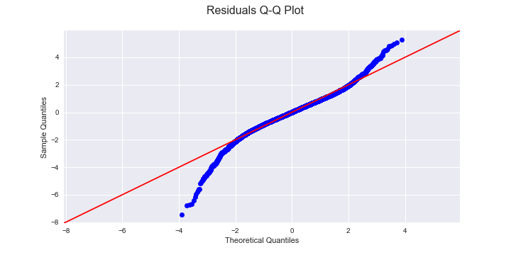
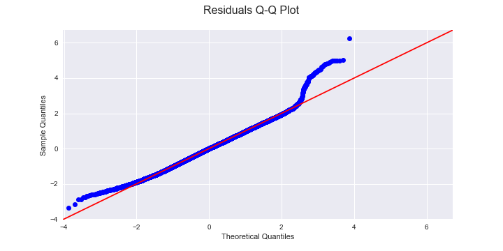

# King County Regression

**Authors**: Dave Brown, Michael Tiernan

## Problem

Mission:  Educate potential buyers on what housing aspects and geographical locations increase the prices of homes.

Steps:
1. Research data and develop a plan.
2. Clean the data
3. Reorganize the dataset
4. Run the regression model
5. Adjust the dataset accordingly
6. Present findings 

## Methodology

For this project, we were given the kc_house_data.csv. The dataset countained information about houses, ranging from the year built, to the number of bedrooms and bathrooms, to the total square feet of living space of the closest 15 neighbors.

After taking care any possible duplicate and null values, we eliminated any possible outliers. Then, we feature engineered the dataset to find what effect the location of the home had on price, and dealt with the categorical values. Columns for the distance from Seattle and Bellevue were added. Grade and Condition were put into different classes. Next, we checked for any multicollinearity issues and added interactions to fix the problem. Finally, we normalized the data and removed any columns that had a P value of over .05 to see if that would improve the model.

## Results

Our final model that had an R Squared value of .791.

The mean of the residuals was 6.963e-14.

## Reccomendations

There is a strong correlation between the price of a home and the number of bathrooms. If buyers are looking to save money, we recommend looking for a house with less than 2 bathrooms. If buyers are looking for a house on the higher-end of the market, we recommend looking for a house with at least 2.5 bathrooms

As the living space of your neighbors (in terms of sqft) increases, price increases  For buyers, seeking a house on the lower end, we recommend to look for a house where the sqft of the neighbors is on the smaller end, anywhere below 1,500 sqft. For buyers looking at higher end homes, we would recommend buying where their neighbors have 2,500 sqft of living space or more.

The closer the home is to a city, the more expensive it will be. We reccomend looking further away from a city if buyers are looking to save money. It is also more expensive to live near Bellevue than it is to live near Seattle.

## Limitations

This model has limitations. The data was normalized with log transformations. Any additional datasets would need to also be log transformed in order for the model to accurately predict the price. Also, this model only applies to King County. Due to differences in home values in different areas of the country, the model may not accurately predict prices outside of the county. A separate anaylsis and regression model should be done to find the best predictors of home prices in a new area.

## Future Work

1. How has the housing situation changed since then? Are there better predictors?
2. Why is the relationship so strong between price and proximity to cities?
3. What are the best predictors of price for homes outside of King County?
4. What is the effect that interest rates have on housing prices?
5. How much of an impact do property taxes have on the sale of homes?

## For More Information

Please review our full analysis our [notebook](/regression_notebook.ipynb) and our [presentation](/King_County_Presentation.pdf).

For any additional questions, please contact Dave Brown: davebrown271@gmail.com or Michael Tiernan: michael.tiernan.j@gmail.com

## Repository Structure
#### Main Page
    ├── README.md                              <- The top-level README for reviewers of this project
    ├── regression_notebook.ipynb              <- The notebook for the regression analysis
    ├── data
        ├── kc_house_data.csv                  <- The original dataset used for this project
        ├── column_names.md                    <- Descriptions of the columns in the kc housing dataset
